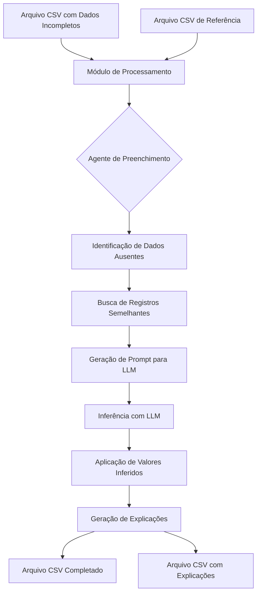

# Diagrama e Apresentação do Projeto - Agente de Preenchimento de Dados de Importação

## Visão Geral do Projeto

Este projeto utiliza Inteligência Artificial (LLMs - Large Language Models) para completar dados faltantes em registros de importação/exportação. O sistema analisa registros históricos semelhantes para inferir os valores ausentes, proporcionando uma solução automatizada para melhorar a qualidade e completude dos dados.

## Arquitetura do Sistema



## Componentes Principais

### 1. Módulo de Processamento de Dados
- **Arquivo:** `utils.py`
- **Funções principais:**
  - `load_csv`: Carrega arquivos CSV em DataFrames pandas
  - `find_missing_data`: Identifica células vazias e registra quais colunas precisam ser preenchidas
  - `find_similar_rows`: Algoritmo de correspondência que encontra registros semelhantes no conjunto de dados de referência
  - `prepare_inference_data`: Prepara os dados para enviar ao LLM

### 2. Agente de Inferência com LLM
- **Arquivo:** `agent.py`
- **Funções principais:**
  - Inicialização do modelo LLM (OpenAI)
  - Processamento de lotes de registros
  - Gerenciamento de respostas do LLM
  - Atualização dos dados com valores inferidos

### 3. Scripts de Execução
- **Arquivos:** `main.py`, `run.py`, `run_with_explanations.py`
- **Funções:**
  - Definição de parâmetros de execução
  - Interface de linha de comando
  - Relatórios de processamento

### 4. Análise e Engenharia de Prompts
- **Arquivos:** `analyze.py`, `prompt_engineering.py`
- **Funções:**
  - Análise de padrões de dados ausentes
  - Otimização de prompts para o LLM

## Fluxo de Dados

1. **Entrada**: 
   - Arquivo CSV com dados incompletos (`duimp_202502.csv`)
   - Conjunto de dados de referência completo (`duimp_completa__202412.csv`)

2. **Processamento**:
   - Para cada registro com dados ausentes:
     - Identificar quais colunas estão faltando
     - Encontrar registros semelhantes no conjunto de referência
     - Formatar um prompt para o LLM com:
       - Dados do registro atual
       - Colunas ausentes
       - Registros semelhantes
       - Descrições de colunas
     - Enviar para o LLM inferir os valores mais prováveis
     - Capturar valores inferidos e suas explicações

3. **Saída**:
   - Arquivo CSV com todos os valores preenchidos (`duimp_completed.csv`)
   - Arquivo CSV com explicações para cada inferência (`duimp_completed_with_explanations.csv`)

## Exemplo de Inferência

Para um registro como:
```
"2025-02-01","87089200","GB","MARITIMA","PORTO DE PARANAGUA",,"VOLVO LOGISTICS","DUIMP - Crawler Complete"
```
Onde o campo `consignee_code` está ausente, o sistema:

1. Identifica que `consignee_code` está faltando
2. Encontra registros semelhantes com mesmo código NCM, país e modo de transporte
3. Apresenta esses registros ao LLM junto com o contexto
4. O LLM infere o valor mais provável para `consignee_code` baseado nos padrões observados

## Tecnologias Utilizadas

- **Python**: Linguagem de programação principal
- **Pandas**: Processamento de dados tabulares
- **LangChain**: Framework para integração com LLMs
- **OpenAI API**: Modelo de linguagem (GPT-3.5/4) para inferência
- **JSON**: Formato para transferência de dados entre componentes

## Vantagens do Sistema

1. **Automação**: Reduz drasticamente o trabalho manual de completar dados ausentes
2. **Consistência**: Aplicação de regras consistentes baseadas em padrões históricos
3. **Explicabilidade**: Fornece explicações para cada inferência, tornando o processo transparente
4. **Flexibilidade**: Pode ser adaptado para diferentes tipos de dados de importação/exportação
5. **Escalabilidade**: Processamento em lotes permite lidar com grandes conjuntos de dados

## Possíveis Melhorias

1. Implementação de validação adicional dos valores inferidos
2. Integração com fontes de dados externas para enriquecer a inferência
3. Interface visual para revisão e ajuste das inferências
4. Ajuste fino do modelo para melhorar a precisão das inferências
5. Implementação de cache para otimizar o processamento de registros semelhantes 