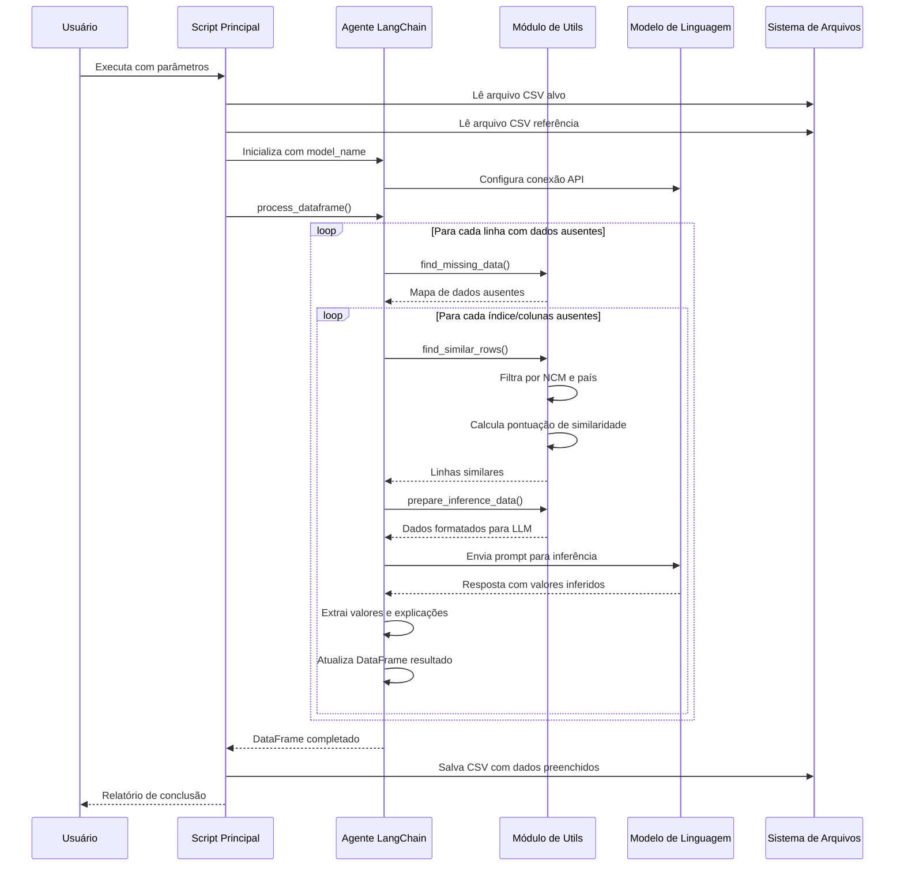
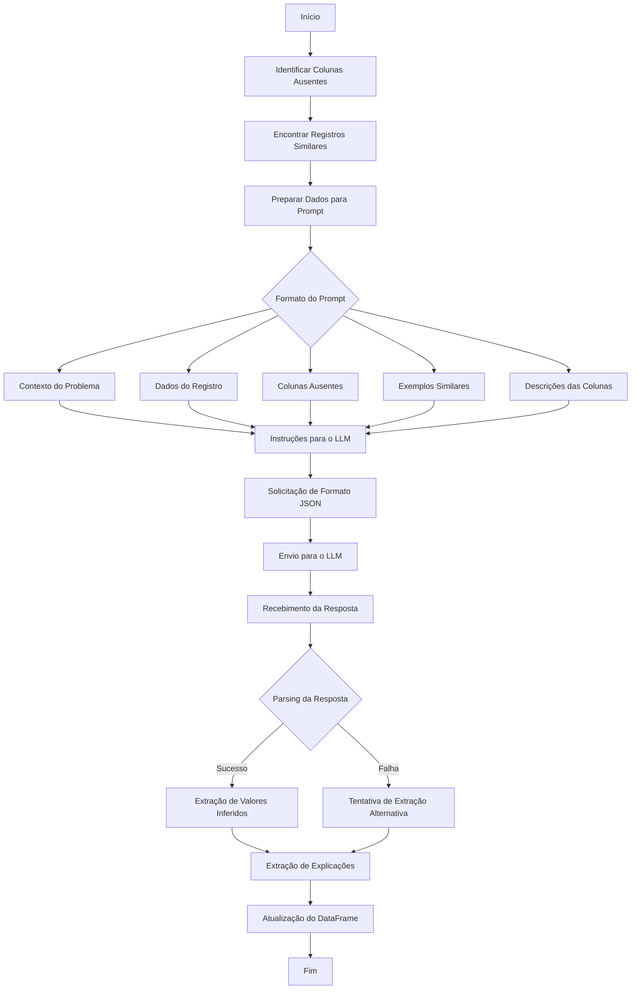
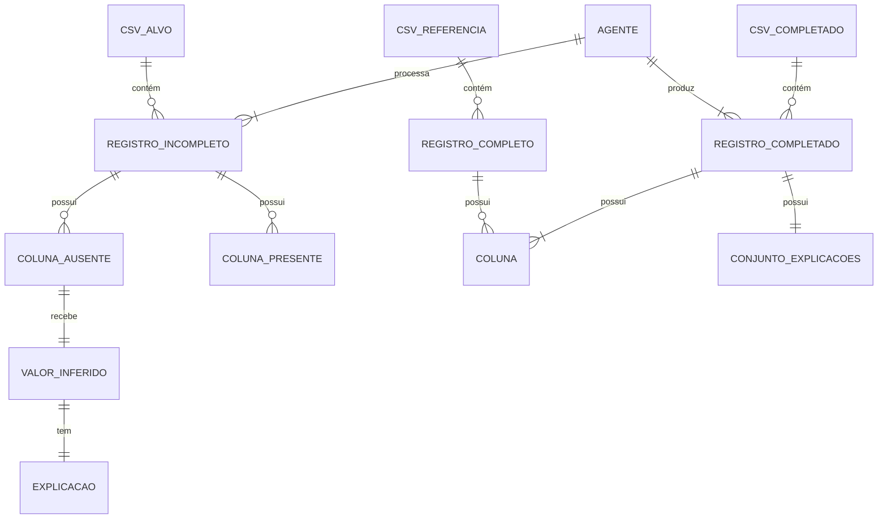
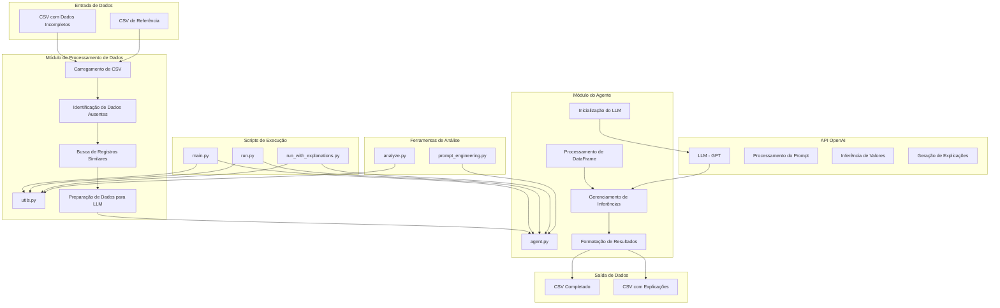

# Diagrama de Fluxo de Processo Detalhado

## Processo de Preenchimento de Dados Ausentes

```mermaid
sequenceDiagram
    participant Usuario as Usuário
    participant Main as Script Principal
    participant Agent as Agente LangChain
    participant Utils as Módulo de Utils
    participant LLM as Modelo de Linguagem
    participant FS as Sistema de Arquivos

    Usuario->>Main: Executa com parâmetros
    Main->>FS: Lê arquivo CSV alvo
    Main->>FS: Lê arquivo CSV referência
    Main->>Agent: Inicializa com model_name
    Agent->>LLM: Configura conexão API
    
    Main->>Agent: process_dataframe()
    
    loop Para cada linha com dados ausentes
        Agent->>Utils: find_missing_data()
        Utils-->>Agent: Mapa de dados ausentes
        
        loop Para cada índice/colunas ausentes
            Agent->>Utils: find_similar_rows()
            Utils->>Utils: Filtra por NCM e país
            Utils->>Utils: Calcula pontuação de similaridade
            Utils-->>Agent: Linhas similares
            
            Agent->>Utils: prepare_inference_data()
            Utils-->>Agent: Dados formatados para LLM
            
            Agent->>LLM: Envia prompt para inferência
            LLM-->>Agent: Resposta com valores inferidos
            
            Agent->>Agent: Extrai valores e explicações
            Agent->>Agent: Atualiza DataFrame resultado
        end
    end
    
    Agent-->>Main: DataFrame completado
    Main->>FS: Salva CSV com dados preenchidos
    Main-->>Usuario: Relatório de conclusão
```

## Processo de Engenharia de Prompt

```mermaid
flowchart TD
    A[Início] --> B[Identificar Colunas Ausentes]
    B --> C[Encontrar Registros Similares]
    C --> D[Preparar Dados para Prompt]
    
    D --> E{Formato do Prompt}
    E --> F[Contexto do Problema]
    E --> G[Dados do Registro]
    E --> H[Colunas Ausentes]
    E --> I[Exemplos Similares]
    E --> J[Descrições das Colunas]
    
    F & G & H & I & J --> K[Instruções para o LLM]
    K --> L[Solicitação de Formato JSON]
    L --> M[Envio para o LLM]
    
    M --> N[Recebimento da Resposta]
    N --> O{Parsing da Resposta}
    O -->|Sucesso| P[Extração de Valores Inferidos]
    O -->|Falha| Q[Tentativa de Extração Alternativa]
    
    P --> R[Extração de Explicações]
    Q --> R
    
    R --> S[Atualização do DataFrame]
    S --> T[Fim]
```

## Estrutura de Dados

```mermaid
erDiagram
    CSV_ALVO ||--o{ REGISTRO_INCOMPLETO : contém
    CSV_REFERENCIA ||--o{ REGISTRO_COMPLETO : contém
    REGISTRO_INCOMPLETO ||--o{ COLUNA_AUSENTE : possui
    REGISTRO_INCOMPLETO ||--o{ COLUNA_PRESENTE : possui
    REGISTRO_COMPLETO ||--o{ COLUNA : possui
    
    AGENTE ||--|{ REGISTRO_INCOMPLETO : processa
    AGENTE ||--|{ REGISTRO_COMPLETADO : produz
    
    COLUNA_AUSENTE ||--|| VALOR_INFERIDO : recebe
    VALOR_INFERIDO ||--|| EXPLICACAO : tem
    
    REGISTRO_COMPLETADO ||--|{ COLUNA : possui
    REGISTRO_COMPLETADO ||--|| CONJUNTO_EXPLICACOES : possui
    
    CSV_COMPLETADO ||--o{ REGISTRO_COMPLETADO : contém
```

## Diagrama de Arquitetura de Sistema

```mermaid
graph TB
    subgraph "Entrada de Dados"
        A[CSV com Dados Incompletos]
        B[CSV de Referência]
    end
    
    subgraph "Módulo de Processamento de Dados"
        C[utils.py]
        C1[Carregamento de CSV]
        C2[Identificação de Dados Ausentes]
        C3[Busca de Registros Similares]
        C4[Preparação de Dados para LLM]
    end
    
    subgraph "Módulo do Agente"
        D[agent.py]
        D1[Inicialização do LLM]
        D2[Processamento de DataFrame]
        D3[Gerenciamento de Inferências]
        D4[Formatação de Resultados]
    end
    
    subgraph "API OpenAI"
        E[LLM - GPT]
        E1[Processamento do Prompt]
        E2[Inferência de Valores]
        E3[Geração de Explicações]
    end
    
    subgraph "Scripts de Execução"
        F1[main.py]
        F2[run.py]
        F3[run_with_explanations.py]
    end
    
    subgraph "Ferramentas de Análise"
        G1[analyze.py]
        G2[prompt_engineering.py]
    end
    
    subgraph "Saída de Dados"
        H1[CSV Completado]
        H2[CSV com Explicações]
    end
    
    A --> C1
    B --> C1
    C1 --> C2
    C2 --> C3
    C3 --> C4
    
    C4 --> D
    
    D1 --> E
    D2 --> D3
    E --> D3
    D3 --> D4
    
    F1 --> C
    F1 --> D
    F2 --> C
    F2 --> D
    F3 --> C
    F3 --> D
    
    D4 --> H1
    D4 --> H2
    
    G1 --> C
    G2 --> D
``` 